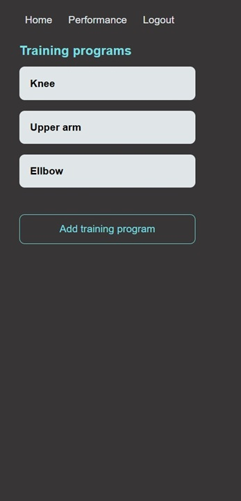
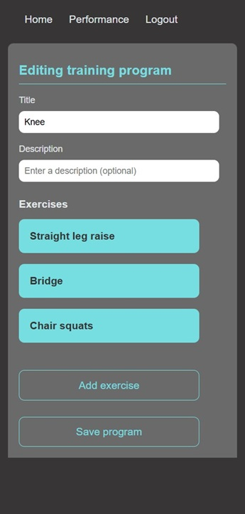
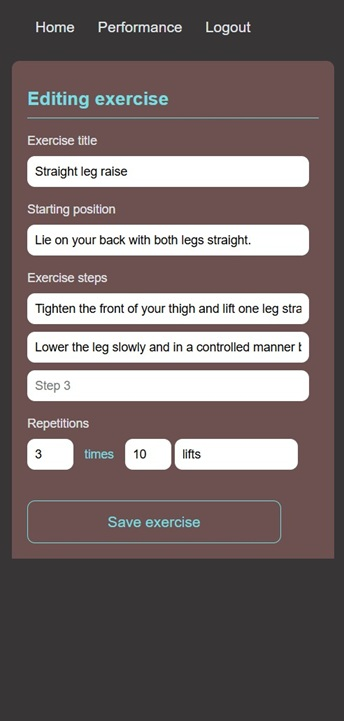
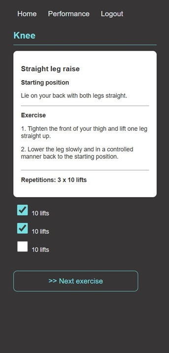
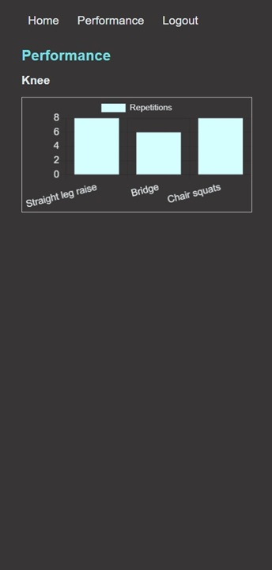

# MyPhysioTrainer

## Background

This application is a student project that I built as part of the [Software Development Project course](https://coursepress.lnu.se/kurser/mjukvaruutvecklingsprojekt/) during the first year of the [Web Programmer Programme at Linneaus University](https://coursepress.lnu.se/program/webbprogrammerare/).

## Description

MyPhysioTrainer helps users to follow the exercises and training programs that they have been given by their physiotherapist and other caregivers. The application lets them add training programs and exercises and provides statistics on exercises performed.  
The statistics function introduces an element of gamification to motivate users to do the exercises. It also facilitates reports to the caregiver during return visits, as it makes it easier to account for how often the exercises actually have been done.

## Visuals

### Home screen with overview of training programs

### Editing a training program and adding an exercise

### Performing an exercise and displaying performance statistics

## Usage

1. Start by creating a user account.
2. Add a training program by giving it a name and a description.
3. Add the exercises to your program.
4. When you are performing the program, click on **Run program** and select the checkboxes for the number of repetions that you have carried out. 
  
It is possible to add training programs and exercises as JSON data via REST API.

## Contact

mm225mz@student.lnu.se

## Project status

First major release 2025-05-23.